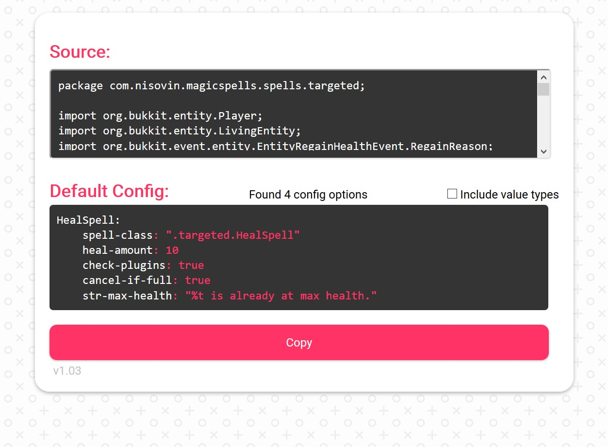

# Scribe
A <a href="https://github.com/TheComputerGeek2/MagicSpells">MagicSpells</a> sourcecode intrepreter by Iniquit that reads <a href="https://github.com/TheComputerGeek2/MagicSpells/tree/4.0/core/src/main/java/com/nisovin/magicspells/spells" target="_blank">MS 4.0+</a> spell java files using regex to generate default spell config YAML. 

https://iniquit.github.io/scribe/

